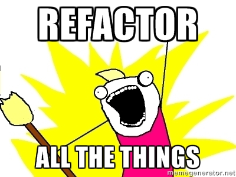
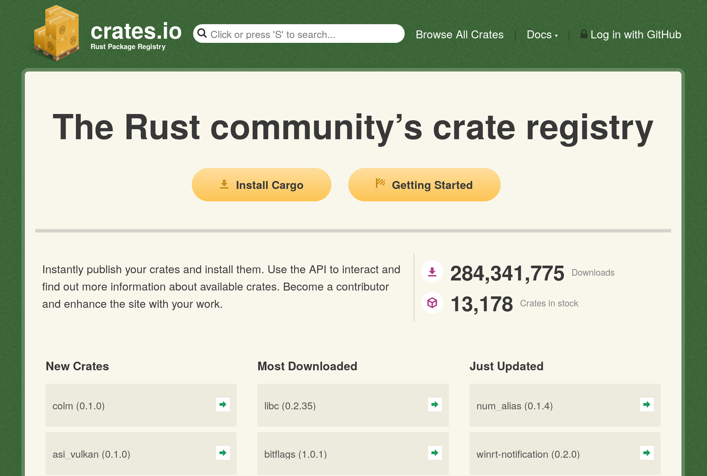

class: center, middle, ferris

Rust Introduction
=================

Wesley Moore
------------


---

# Agenda

1. Features
2. Tooling
3. Syntax
4. Demo
5. Questions

---

# Introduction

```rust
fn main() {
  println!("Rust Introduction");
}
```

> **Rust** is a systems programming language that runs blazingly fast, prevents
> segfaults, and guarantees thread safety. 

— [rust-lang.org](https://www.rust-lang.org/)

---

# Systems Programming Language

* Compiles to native code

--

* Originally imagined for the types of problems C and C++ are used to solve.

--

* Is seeing use outside that:
  * Embedded systems
  * Operating systems ([Redox OS][redox])
  * Web servers, applications, and compilation to web assembly
  * GUI applications

---

# Runs Blazingly Fast

* Native code, no interpreter.

--

* Same ballpark as C and C++.

--

* Memory safety without garbage collection.

--

* Strong, statically typed language with an emphasis on safety and correctness.

--

* No runtime.

---

class: segfaults

# Prevents Segfaults

* No `NULL`, `nil` or other [billion dollar mistakes][billion-dollar-mistake].


This is not a thing. At all. Ever.

.center[[billion-dollar-mistake]: https://www.infoq.com/presentations/Null-References-The-Billion-Dollar-Mistake-Tony-Hoare]

---

# Guarantees Thread Safety

* Ownership model tracks owner and lifetime of memory.

--

* No data races: Compiler knows which thread owns what data.

--

* This leads to, "[Fearless Concurrency][fearless-concurrency]".

> Mozilla made two previous attempts to parallelize its style system in C++,
> and both of them failed. But Rust’s fearless concurrency has made parallelism
> practical!

— [Fearless Concurrency in Firefox Quantum](https://blog.rust-lang.org/2017/11/14/Fearless-Concurrency-In-Firefox-Quantum.html) (Nov 2017)

---

class: refactor

# Strong Static Type System

* Do more at compile time so fewer tests and runtime checks are required.

--

* Concepts mostly familiar. No need to learn an entirely new paradigm.

--

* Traits and generics instead of objects and inheritance.

--

* Type inference reduces the need to provide type annotations.

--

* Refactor with impunity.
--


---

# Tooling

Official distribution includes: `cargo`
--
:

* build tool (no Makefiles)

--

* package manager (like bundler)

--

* test runner

--

* documentation generator

---

## Releases

Generally managed with `rustup`
--
:

* Official toolchain manager (like rbenv)

--

* New releases every 6 weeks
  * Committed to backwards compatibility for every release.

---

class: crates

# Crates

* Rust favours a small, stable standard library.
* Crates are the equivalient of Ruby gems. They are published to
  [crates.io](https://crates.io/).



---

class: center, middle

Syntax
======

---

# Variables (Bindings)

`let` bindings are mutable by default.

```rust,skt-basic-main
let number = 42; // immutable
let mut total = 0; // mutable
```

---

# Functions

```rust
fn average(values: &[i32]) -> i32 {
    values.iter().sum::<i32>() / values.len() as i32
}

fn main() {
    average(&[1,2,3,4,5]);
}
```

---

# Conditionals: if

```rust,skt-basic-main
let airconditioner;
let temperature: i32 = 42;

if temperature > 35 {
    airconditioner = true;
}
else {
    airconditioner = false;
}
```

---

# Conditionals: match

Can match structure and values:

```rust,skt-basic-main
let month = "jan";

match month {
    "jan" => 1,  "feb" => 2,
    "mar" => 3,  "apr" => 4,
    "may" => 5,  "jun" => 6,
    "jul" => 7,  "aug" => 8,
    "sep" => 9,  "oct" => 10,
    "nov" => 11, "dec" => 12,
    _     => panic!("invalid month"),
};

```


---

# Loops

```rust,skt-basic-main
let numbers = [1,2,3];

for i in numbers.iter() {
    // do something
}

for i in 0..10 {
    // do something
}
```

---

# Loops

```rust,skt-basic-main
let numbers = [1,2,3];

loop {
    // do something

    if numbers.len() > 2 {
      break;
    }
}

while numbers.len() < 2 {
    // do something
}
```

---

# Functional or Imperative

```rust,skt-var-mean
fn variance_mean(data: &[f64], mean: f64) -> f64 {
    let mut sum = 0.;

    for d in data {
        sum += (d - mean).powf(2.0);
    }

    sum / data.len() as f64
}
```

---

# Functional or Imperative

```rust,skt-var-mean
fn variance_mean(data: &[f64], mean: f64) -> f64 {
    data.into_iter()
        .map(|d| (d - mean).powf(2.0))
        .sum::<f64>() / data.len() as f64
}
```

--

You pay _no cost_ for using the higher level style, it compiles the identical machine code (I checked).

---

# enums

Type that represents one possibility of several variants. Variants may optionally
carry data.

```rust,skt-type-demo
enum SerialProtocol {
    Usb,
    Rs485,
    Rs232,
    I2C,
    Spi,
}
```

---

# structs

Type that carries structured data.

```rust,skt-serial
struct Person {
    name: String,
    age: i32,
    favourite_serial_protocol: SerialProtocol,
}
```

---

# Option

Instead of `nil`/`NULL` we have `Option`.

* Used to represent something that may be absent.
* An enum that that looks like this:

```rust,skt-type-demo
enum Option<T> {
    Some(T),
    None
}
```

---

# Result

When something can succeed or fail with an error.

* There are no exceptions in Rust, `Result` is how you handle errors.
* An enum that that looks like this:

```rust,skt-type-demo
enum Result<T, E> {
    Ok(T),
    Err(E)
}
```

---

class: center, middle

Demo
====

---

Demo
====

Small tool that will determine a file's type from its extension:

```shell
filetype src/main.rs somefile.rb
```

Should give output like:

```
Rust: src/main.rs
Ruby: src/somefile.rb
```

---

class: center, middle

Demo
====

---

class: center, middle

Questions?
==========

---

Credits
=======

* [Animated Ferris][animated-ferris] by A. L. Palmer, via [rustacean.net][rustacean].
* Original [All the Things][all-the-things] illustration by Allie Brosh
* Portions of this talk were derived from [A Very Brief Intro to Rust][rust-intro]  
  Copyright © 2016 Ashley Williams.

[rust-intro]: https://github.com/rustbridge/a-very-brief-intro-to-rust
[animated-ferris]: https://www.behance.net/gallery/42774743/Rustacean
[rustacean]: http://rustacean.net/
[all-the-things]: https://hyperboleandahalf.blogspot.com.au/2010/06/this-is-why-ill-never-be-adult.html
[fearless-concurrency]: https://doc.rust-lang.org/book/second-edition/ch16-00-concurrency.html
[redox]: https://www.redox-os.org/
