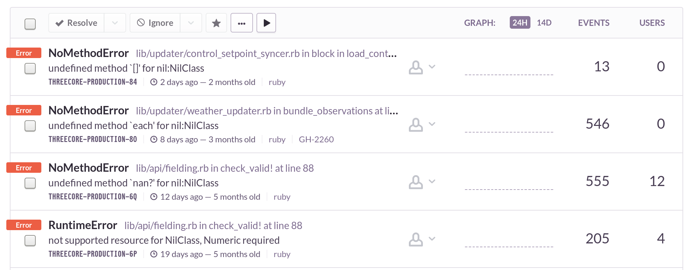

class: center, middle

# Rust Intro

---

# Agenda

1. Introduction
2. Demo
3. Questions

---

# Introduction

```rust
fn main() {
  println!("Rust Introduction");
}
```

> **Rust** is a systems programming language that runs blazingly fast, prevents segfaults, and guarantees thread safety. 

.indent[— [rust-lang.org](https://www.rust-lang.org/)]

---

# Runs Blazingly Fast

* Complies to native code
* Same ballpark as C and C++
* Memory saftey without garbage collection
* Strong, statically typed lanuage with an emphasis on saftey and correctness
* No runtime

---

# Prevents Segfaults

* No `NULL`, `nil` or other [billion dollar mistakes][billion-dollar-mistake]

This is not a thing. At all. Ever.



.center[[billion-dollar-mistake]: https://www.infoq.com/presentations/Null-References-The-Billion-Dollar-Mistake-Tony-Hoare]

---

# Guarantees Thread Safety

* Ownership model tracks owener and lifetime of memory
* No data races: Compiler knows which thread owns what data
* This leads to, "Fearless Concurrency"

---

# Strong Type System

* Not object oriented
* Trait based generics
* Type inference
  * Function definitiions must have types

* Integers: `i32`, `u32`, `i64`, `u64`, `isize`, `usize`
* Floating point: `f32`, `f64`
* `String`/`str`

# Syntax — Variables (Bindings)

Let bindings are mutable by default

```rust
let number = 42; // immutable
let mut sum = 0; // mutable
```

# Syntax - Functions

```rust
```


---

# 

---

# Standard Tooling

* official distribution includes:
* `cargo` build tool (like bundler, no Makefiles)
* built in support for tests
* built in suppoprt for Markdown based documentation
* `rustup` toolchain manager (like rbenv)

# Syntax & Concepts

Mostly the same as other languages. No need to learn an entirely new paradigm.

* Not object oriented
* Uses traits (like interfaces) to collect related behaviour and avoid the need for inheritance.
* Variables are immutable by default

---

# Functional or imperative

You pay _no cost_ for using the higher level style.

```rust,skt-var-mean
fn variance_mean(data: &[f64], mean: f64) -> f64 {
    let mut sum = 0.;

    for d in data {
        sum += (d - mean).powf(2.0);
    }

    sum / data.len() as f64
}
```

compiles the identical machine code (I checked) as:

```rust,skt-var-mean
fn variance_mean(data: &[f64], mean: f64) -> f64 {
    data.into_iter()
        .map(|d| (d - mean).powf(2.0))
        .sum::<f64>() / data.len() as f64
}
```


